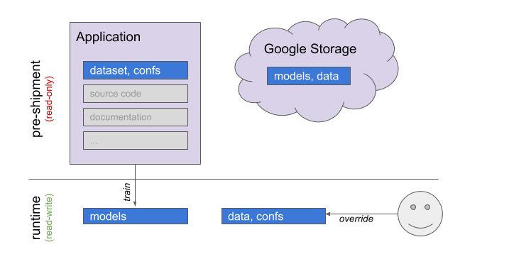
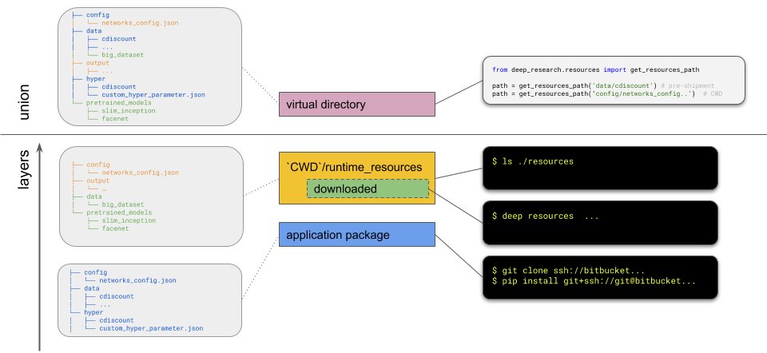

## Resources system
Deephub has a unified and type-agnostic way to access resources on the file system. Its API is implementation
resides in `deephub.resources` package and the API consists of a few functions.

### Resource types and sources



Various different types of resources can be used at runtime. Although
the resource system does not categorize resources based on its type it may prove helpful
to know the common use cases in order to understand the system itself:
* `dataset`: Usually toy datasets that are use for experimentation or quality assurance. This type are typically
feeded by trainer either as part of a tensorflow ETL or as in-memory object.
* `configurations`: There are some various configurations like `variants.yaml` or `hpt related configs` that
are populated along with code development. This is usually loaded in memory as python native objects.
* `models`: Weights of pretrained models in various formats. The format is Tensorflow protobufs or checkpoint files.
* `others`: The resource system is not limited in any kind of resource as long as it is accessible
in the local filesystem.


Resources resides in different location depending on the usage scenario as also on their size. The
following sources are possible:
* `application package`: Some resources, especially those that are tightly coupled with source code are shipped
alongside with the source code. Usually these resources must be version controlled and their size
does not introduce a bottleneck.
* `google storage`: Resources that are optional and are needed by some modules are stored in google
storage and can be downloaded from CLI of the resource system. Usually these resources have large
size and are of dataset, models type.
* `user directory`: At runtime user can provide extra resource files to override existing files or 
provide more datasets or models.

### Resources à la UnionFS 

The resource system is designed in the concept of UnionFS where different sources are presented as
directory layers and a virtual directory is exposed with the union
of all layers. For cases where multiple layers provide the same file paths, then the
layer with the highest priority is preferred.

In the image below we can see the unification of 3 different layers and the resource in virtual directory.


To access the virtual directory the developer has two entry points:
 * `get_resource_path`: It will translate any relative path in virtual directory in an absolute path in 
 the local filesystem. The absolute path is selected based on the **uppermost** layer that the file 
 exists in.
 * `get_resources_writable_directory`: It will map any relative path of the virtual directory to
 the **uppermost writable** layer and will return the absolute path of this layer in local filesystem.


#### Resources layers

The actual implementation of resource system consists of **2 layers** at the moment.

##### Layer 0: Application package
This layer is versioned controlled along with the source code inside the package `deephub.resources.blobs`. It
is included in the final application packaged and installed in the target environment. It has the lowest
priority and is considered read-only.

##### Layer 1: `$(cwd)/runtime_resources`
This layer resides in folder `runtime_resources` of the current working directory, it has the highest priority
and is considered writable. This layer is populated by the end user with custom files or for overriding
files that exist in `application package`. It is also used to download and store the remote resources.

### Remote resources
Some resources are stored in google storage and an entrypoint is provided to download them in your runtime layer.
All remote resources are registered under [remote.yaml]('../deephub/resources/remote.yaml') as a list
of dictionaries with the following keys:

* **name**: A friendly and unique name of the resources. This will be used as resource ID by the end-user on any CLI operation.
* **dst_path**: The destination path (file or directory) inside the virtual directory of resources. For recursive path you *MUST* put a trailing `/`.
* **gs_url**: The google storage source url such as `gs://deeplab/deep_resourecs/...`

#### Download remote resources
Deephub is shipped with various resources such as models, toy data etc. Some of these resources are included
in the source repository especially the small ones. The rest are stored in a google storage bucket
and **must** be downloaded for certain functionality to be usable.

**Prerequisites**: For CLI tool to be usable you need to have installed the [google cloud SDK](https://cloud.google.com/sdk/)
and authenticate with your personal account so that `gsutil` command is available and working in your path.


To see which resources are available remotely you can run:
```
$ deep resources list
```

Example output:
```
ASSET_ID    Type    Size      Source URL
----------  ------  --------  --------------------------------------------------------------------------
inception   File    103.8MiB  gs://deeplab/pretrained_models/slim_inception_pretrained/inception_v3.ckpt

```

To download all resources you should issue the following command:
```
$ deep resources download <RESOURCE_ID>
```
